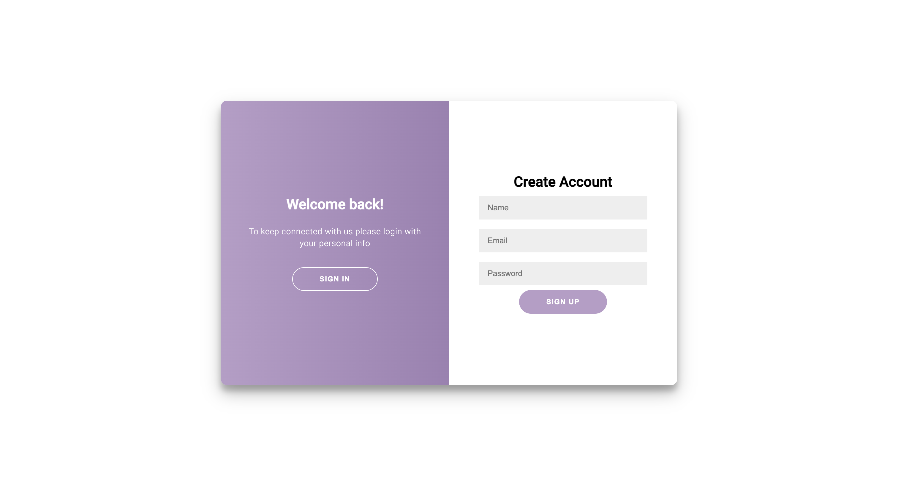
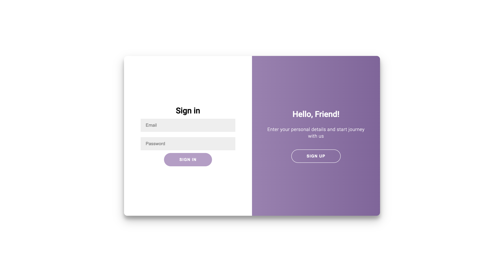
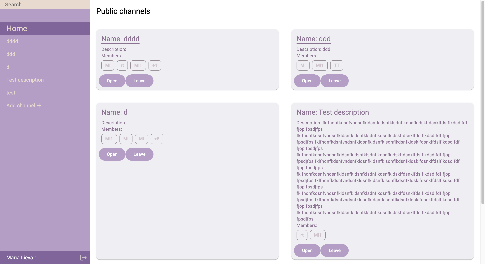
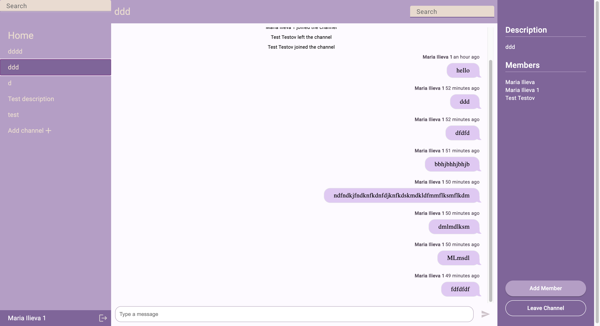

# Софийски университет “Св. Климент Охридски”  
## Факултет по математика и информатика

## Курсов проект по “Web технологии”  
### летен семестър 2023/2024

#### Тема - Instant Messenger
#### Изработили: 
- Мария Илиева
- Мария Маргаритова
- Мая Денева
- Стелиана Димитрова

#### Специалност: Информационни системи  
#### Курс: 3

#### Гр. София  
#### Юни 2024

---

## Съдържание:

1. Идея на проекта
2. Използвани технологии

## 1. Идея на проекта

### 1.1 Обща идея на проекта
Instant Messenger проекта има за цел да предостави платформа за комуникация в реално време между потребители чрез текстови съобщения. Приложението поддържа канали, в които потребителите могат да се присъединяват и общуват. Допълнително, потребителите имат възможност да търсят в историята на съобщенията и да създават публични или частни канали.

### 1.2 Задачи на разработката

* Потребители - възможност за регистриране, създаване на канали и присъединяване към канали 
* Публични канали и затворени канали - възможност за създаване на публични канали, в които всеки потребител може да се включи (или да напусне), да покани други потребители по имейл, или да създаде
* История на съобщенията - възможност за преглед на всички съществуващи съобщения, изпратени в даден канал
* Търсене в каналите - търсне на съобщение в канал по зададена ключова дума
* Real-time комуникация

### 1.3 Изгледи

#### 1.3.1 Регистрация

#### 1.3.2 Логин

#### 1.3.3 Начална страница

#### 1.3.4 Изглед на канал

## 2. Използвани технологии
### Frontend:
- Angular
- HTML
- SCSS
- Typescript

### Backend
- Node.js
- Express.js
- Socket.io
- JWT
- Bcrypt

### Database
- MongoDB
- Mongoose
